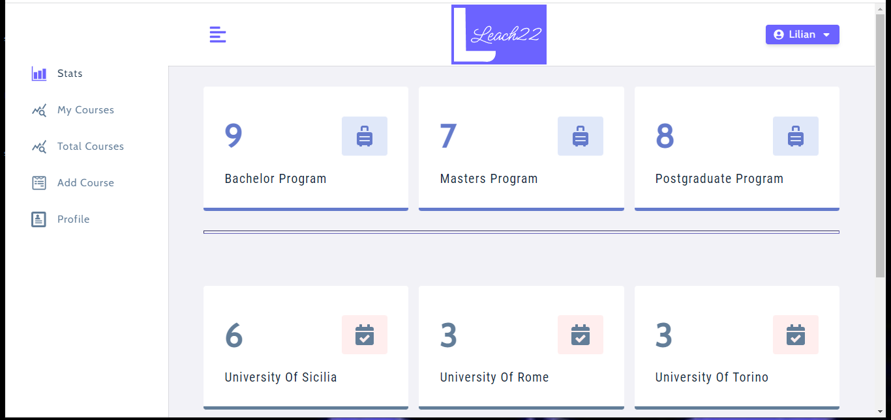

# Leach22-course-catalog
<p align="center">

  <p align="center">
    <a href="https://github.com/oglili/Leach22-course-catalog">
        
    </a>
   </p>
  
  <h3 align="center">Leach22 Course Catalog</h3>

  <p align="center">
     Leach22 is a UN goal-based university training platform where you can Register/Log in to check the available courses that you can register for.
</p>

  <br>
  <br>


<details open="open">
  <summary><h2 style="display: inline-block">Table of Contents</h2></summary>
  <ol>
    <li>
      <a href="#about-the-project">About The Project</a>
      <ul>
        <li><a href="#user-permissions">User Permissions</a></li>
        <li><a href="#some-technologies-used">Some Technologies Used</a></li>
      </ul>
    </li>
    <li>
      <a href="#getting-started">Getting Started</a>
      <ul>
        <li><a href="#prerequisites">Prerequisites</a></li>
        <li><a href="#installation">Installation</a></li>
        <li><a href="#test">Test</a></li>
        <li><a href="#use-app">Use App</a></li>
      </ul>
    </li>
    <li><a href="#license">License</a></li>
    <li><a href="#links">Links</a></li>
    <li><a href="#contributing">Contributing</a></li>    
  </ol>
</details>

## About The Project
In this project I created a RESTful JSON APIs using Express js, which provides a way for insertion of the courses offered by the platform into the database. Users can interact with the database by retrieving a list of courses offered by the platform, updating and deleting any courses they register for. React.js was used to create the frontend user interface.

### User Permissions
## User Permissions

### Student

A student can

* register himself on the app
* view and edit his profile
* change his password
* search for books and view availabilty
* view his issue history

### Admin

An admin can

* view and edit his profile
* search for books and view availability
* view, Edit or Delete existing books
* add new books
* issue a book to a student
* return a book issued earlier
* view all stats of the library
* view issue log and the profile of all the students
* view the profile of all admins 

## A note to the viewers

1. You can try logging in as an **admin** by entering the following credentials:

* **email**: *lilian@gmail.com*
* **password**: *secret*

2. You can also register yourself as a student and then login to view the options available to a student.

### Some Technologies Used

-   [Node.js](https://nodejs.org/en/)
-   [Express js](https://expressjs.com/)
-   [MongoDB/Mongoose](https://mongoosejs.com/)
-   [Normalize CSS](https://necolas.github.io/normalize.css/)
-   [Styled Components](https://styled-components.com/)
-   [JWT](https://jwt.io/)
-   [Bcrypt.js](https://www.npmjs.com/package/bcryptjs)

## Getting Started

### Prerequisites

You use it for your project by following the Installation or Use App to use the app.

### Installation

1. Clone the repository locally with the git command:

    ```sh
    git clone https://github.com/oglili/Leach22-course-catalog.git
    ```
2. Open the package.json to install the dependencies in the client and main folder:
    ```sh
    "scripts": {
        "build-client": "cd client && npm run build",
        "install-client": "cd client && npm install",
        "server": "nodemon server --ignore client",
        "client": "npm start --prefix client",
        "start": "concurrently --kill-others-on-fail \"npm run server\" \" npm run client\""
      }

       ```

3. Create your database with MongoDB/Mongoose & JWT 

4. Create your .env file with your database & JWT credentials 

You can now access the server at http://localhost:5000

REST API project section endpoints:

- `POST /api/v1/auth/register` - To register a user.
- `POST /api/v1/auth/login` - To login a registered user.
- `PATCH /api/v1/auth/updateUser` - To update a user.
- `GET /api/v1/courses` - Returns all courses of the current user.   
- `GET /api/v1/courses/stats` - Returns all course showing statistics.
- `GET /api/v1/courses/total` - Returns all courses.
- `POST /api/v1/courses` - Creates a course.
- `PATCH /api/v1/courses/:id` - Updates a course specifying the id.
- `DELETE /api/v1/courses/:id` - Deletes a course specifying the id.

### Test

- Postman can be used to test the REST API.

### Use App

- Open https://leach22-course-catalog.herokuapp.com/
- Register/Login
- Start adding, editing, deleting courses and viewing all courses in the piattaform.

<h3 align="center">Preview</h3>

  <a href="https://github.com/oglili/Leach22-course-catalog">
    
  </a>
  <br>
  <br>

  <a href="https://github.com/oglili/Leach22-course-catalog">
    
  </a>

  
## License

Distributed  the MIT License. See `LICENSE` for more information.

## Links

Project Repository: [leach22-course-catalog](https://github.com/oglili/Leach22-course-catalog)

Project Website: [leach22-course-catalog - Heroku](https://leach22-course-catalog.herokuapp.com/)

## Contributing

Pull requests are welcome. For major changes, please open an issue first to discuss what you would like to change.
